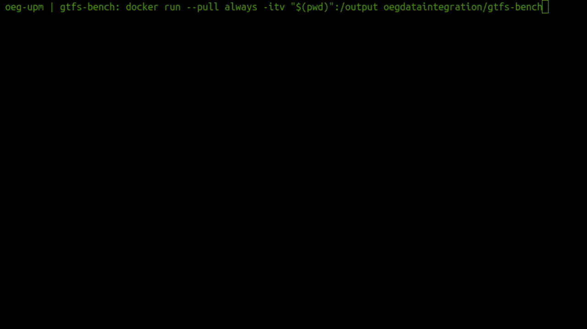

# The GTFS-Madrid-Bench

We present the GTFS-Madrid-Bench, a benchmarking for virutal knowledge graph access in the transport domain. We use the de-facto standard model for publishing open data on web, GTFS, and we scale up and distribute the original dataset in several formats and sizes. This repository contains the following resources:

- Data: we have generated from several datasets(GTFS-[1,5,10,50,100,500]) in multiple formats (CSV, JSON, XML, SQL, MongoDB). The preparation script will download all these datasets and generate a docker-image for each dataset which is contained in a database (MySQL and MongoDB). All the datasets generated by this benchmark have to follow the license of the Consorcio Regional de Transporte de Madrid: https://www.crtm.es/licencia-de-uso?lang=en
- Generation: If any practicioner or developer wants to create datasets with other scale values all the resources are available.
- Queries: 18 queries increasing in terms of complexity + 11 simple queries to test correctness in the translation of SPARQL queries with operators
- Mappings: 1 R2RML mapping document, 7 RML mapping document, 1 xR2RML mapping document, 1 YARRRML mapping and 1 CSVW annotations
- Engines: docker-compose with all the tested engines and running scripts

Paper:
Chaves-Fraga, D., Priyatna, F., Cimmino, A., Toledo, J., Ruckhaus, E., & Corcho, O. (2020). GTFS-Madrid-Bench: A benchmark for virtual knowledge graph access in the transport domain. Journal of Web Semantics, 65. [Online](https://doi.org/10.1016/j.websem.2020.100596)

## Using the Madrid-GTFS-Bench-generator:

1. You can use the following docker image to generate datasets by size and format, also with the proper mapping and queries
2. Run `docker run -p 3307:3306 -p 27018:27017 -itv "$(pwd)":/output oegdataintegration/gtfs-bench`
3. 
4. Result will be available as `result.zip` in the current working directory
4. If selected, you can connect now to the MySQL (3307) and/or MongoDB (27018) deployed servers

## Baseline:
In order to test the completeness of each engine we have also materialized some datasets using the [SDM-RDFizer](https://github.com/SDM-TIB/SDM-RDFizer) engine and make them available through a Virtuoso Triple store: http://gtfs-bench.linkeddata.es/sparql. The data is organized as follows:

1. GTFS original (scale 1) in the GRAPH: http://gtfs1.linkeddata.es 
2. GTFS-5 (scale 5) in the GRAPH: http://gtfs5.linkeddata.es
3. GTFS-10 (scale 10) in the GRAPH: http://gtfs10.linkeddata.es
4. GTFS-50 (scale 50) in the GRAPH: http://gtfs50.linkeddata.es
5. GTFS-100 (scale 100) in the GRAPH: http://gtfs100.linkeddata.es
6. GTFS-500 (scale 500) in the GRAPH: http://gtfs500.linkeddata.es

If other scale value is selected to test the engine, the materialization can be obtained using any [RML-compliant](https://rml.io/implementation-report/) engine (we recommed SDM-RDFizer), the CSVs files exported by VIG and the gtfs-csv.rml.ttl mapping.

## Authors

- David Chaves-Fraga - [dchaves@fi.upm.es](mailto:dchaves@fi.upm.es)
- Freddy Priyatna
- Jhon Toledo
- Daniel Doña
- Edna Ruckhaus
- Andrea Cimmino
- Oscar Corcho

Ontology Engineering Group, October 2019
